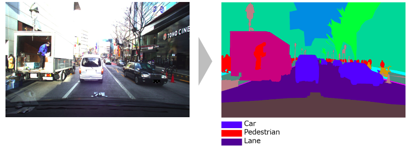
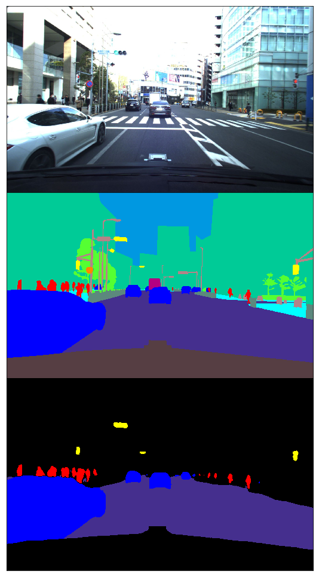
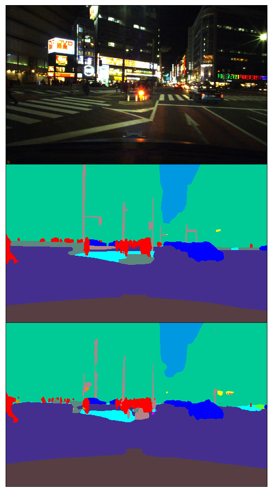

# Signate segmentation
My solution for [AI Edge Contest (Segmentation Division)](https://signate.jp/competitions/143) - 22 place from 402 participants with 0.652 IoU.

## Data

The training data for segmentation models consist of 2,243 images, test data - 649. Images have resolution of 1936 x 1216.
Categories utilized for submission evaluation (but totally in data - 20 categories):
- car
- pedestrian
- signal
- lane.

Notebook with [EDA](https://github.com/EvgenyKashin/signate_segmentation/blob/master/EDA.ipynb).

## Model
I used Unet with different pretrained backbones. Train dataset was splitted on 7 folds
statified by route category and time of day for validation. Notebook with model's [errors analysis](https://github.com/EvgenyKashin/signate_segmentation/blob/master/Error_analysis.ipynb).

## Methods
- Train on crops (256px, 512px, 768px); predict on full, predict on crops, predict on crops with intersection.
- Train on resized (50%, 75% of original size); predict on full, predict on resized + bilinear upsampling.
- Train on full size; predict on full size - **best score**.
- Train on all categories (not only on 4); predict 4 categories.

## What is implemented
- learning rate scheduling
- early stopping
- different backbones (ResNet family + WideResnet)
- different loss functions (bce, jaccard, focal)
- a lot more (see input args of `train.py`)

## What didn't work
- [In-place activated batchnorm](https://github.com/mapillary/inplace_abn) - doesn't reduce memory usage too much
- [fp16 training](https://github.com/NVIDIA/apex) - it's really free a lot GPU memory and you can use bigger batch size,
but model didn't converge to good results (yep, I tried `dynamic_loss_scale=True`)

## TODO
- strong image augmentations
- one cycle learning rate
- snapshot ensembling + folds ensembling
- SE, scSE blocks in decoder
- TTA
- LinkNet
- pseudo labeling
- more experiments with loss combinations

## Training
Best model (resnet 34) was trained on full size images with `batch_size=3` on Titan V CEO Edition with *32 Gb memory* (thanks to [Scitator](https://github.com/Scitator)). 
Training was on all 20 categories with bce loss for 20 epochs (12 hours).

## Prediction visualization
Top image - raw, middle - ground true, bottom - model prediction.
### Model trained on 4 categories

### Model trained on all categories

## Links
- https://github.com/ternaus/TernausNet
- https://github.com/albu/albumentations